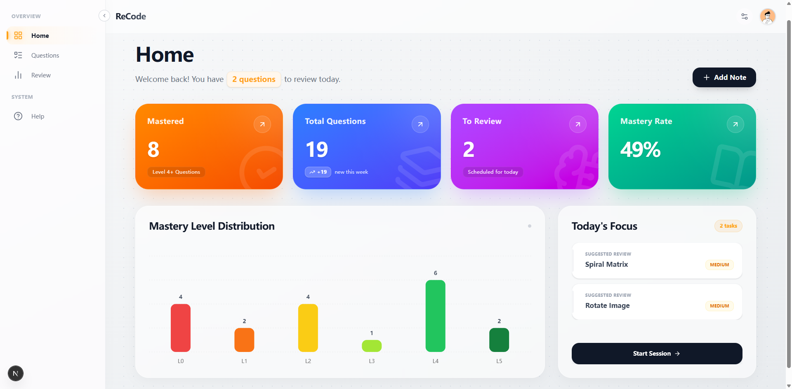
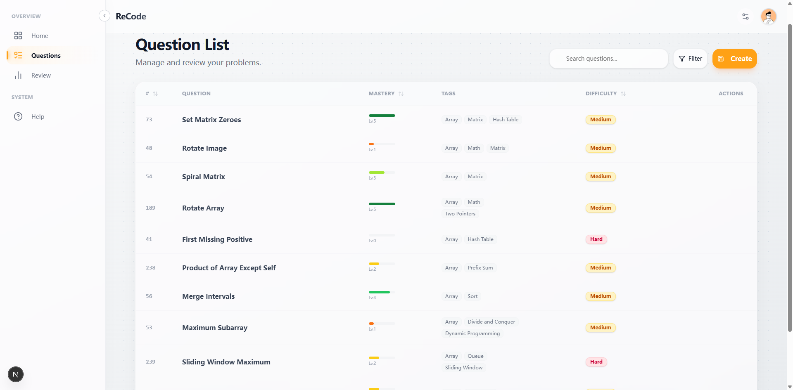
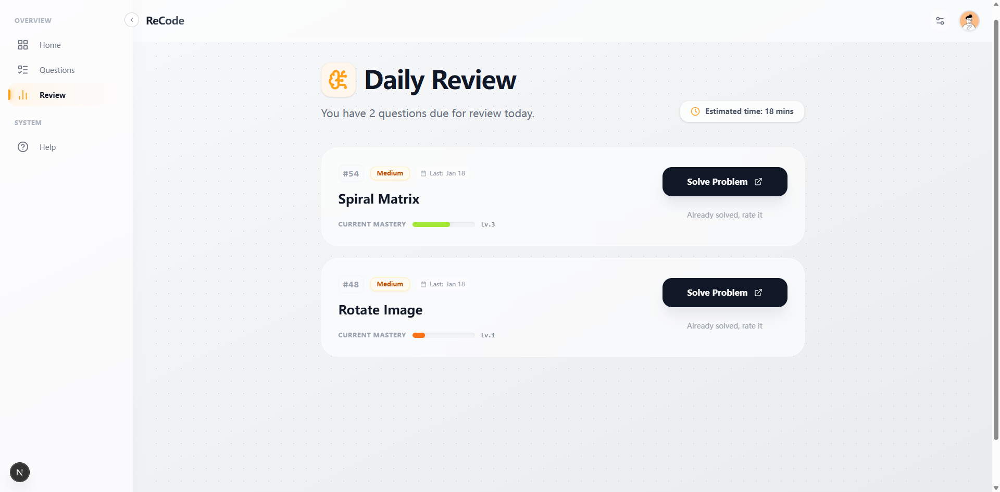

# ReCode - 你的专业级算法练习管家

[English](./README.md)

---

ReCode 是一个专为追求学习效率的开发者设计的算法练习管理工具。它不仅仅是一个笔记应用，更是一个集成编辑体验与科学的间隔复习系统 (SRS) 结合的工具。

💡 注意：此项目当前以源代码模式运行。要使用它，请按照以下步骤进行简单的本地部署。

## 特点

- 🧠 基于经典的 SRS 算法改进而来。系统根据你的自评掌握度（0-5 级）与题目难度，动态计算下一次复习的最佳时机。
- 📝 内置 `Monaco Editor`，支持全语种代码高亮。外加双栏实时预览的 `Markdown` 笔记系统。
- 🔢 支持 `LaTeX` 数学公式渲染，支持记录复杂的算法复杂度分析、数学推导或几何证明。
- 📊 直观的掌握度分布图表、今日任务聚焦点及学习进度追踪。

---





## 技术架构

- 框架: `Next.js 16`
- 界面: `Tailwind CSS 4`, `Framer Motion`
- 数据库: `SQLite` + `Prisma`
- 核心组件: `Monaco Editor`, `React Markdown`, `KaTeX` 等

## 快速上手

### 环境准备

1. `Node.js` (推荐使用 20.x 或更高的版本, 我使用的是 v24.12.0)
   - Download: [Node.js Official Website](https://nodejs.org/) - LTS Version
2. `Git`
   - Download: [Git Official Website](https://git-scm.com/)

### 安装与运行 - 自动

- Windows: 直接双击根目录下的 `start.bat` 即可自动完成安装与启动。

---

- Mac / Linux: 在终端执行:

```bash
chmod +x start.sh && ./start.sh
```

接着双击 `start_mac.sh` 运行即可。

### 安装与运行 - 手动

#### 1. 克隆仓库（或者你可以直接下载压缩包）

```bash
git clone https://github.com/CoisiniIce/ReCode
cd ReCode
```

#### 2. 安装依赖

```bash
npm install
```

注意：这可能需要一些时间。如果由于网络问题安装失败，请考虑使用镜像。

#### 3. 同步数据库, 初始化本地 `SQLite` 数据库并生成 `Prisma` 客户端

此项目使用本地的 `SQLite` 数据库。请执行以下命令来生成数据库文件：

```bash
npx prisma generate
npx prisma db push
```

#### 4. 启动应用

```bash
npm run dev
```

以上步骤都成功后，即可打开浏览器并访问 `http://localhost:3000` 开启你的算法之旅！

## FAQ

### Q1: 数据存储在哪里？

你的所有笔记、代码、复习进度均存储在根目录下的 `prisma/dev.db` 文件中。

- 备份：只需定期将 `dev.db` 文件复制到安全位置即可。

- 迁移：更换电脑时，只需将该文件拷贝至新环境的 `prisma/` 目录下即可。

### Q2: 我能直接查看数据库内容吗？

如果你想查看数据库字段，可以访问 `prisma/schema.prisma`。

如果你想要直接查看或修改底层数据，可以使用下面的命令：

```bash
npx prisma studio
```

这将在您的浏览器中打开一个数据库管理器。您可以直接对数据进行操作（但我并不建议进行手动编辑）。

### Q3: 如果我遇到 `Module not found` 的错误该怎么办？

这通常是由于网络问题导致安装不完整所引起的。请尝试删除 `node_modules` 文件夹，然后再次运行 `npm install`。

---

该项目是个人开发的项目，因此可能会出现一些错误或疏漏。如果您遇到任何问题，请随时在 GitHub 上告知我。